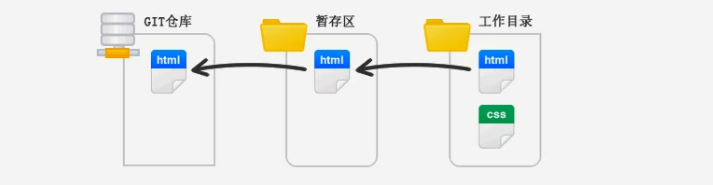

# Git - 版本控制

# Git基础

## 版本管理

版本管理是一种记录文件变化的方式，以便姜来查阅特定版本的文本内容。

### 人为维护文档版本的问题

1. 文档数量多且命名不清晰导致文档版本混乱。
2. 每次编辑文档需要复制，不方便。
3. 多人同时编辑同一个文档，容易产生覆盖。

## Git

Git是一个版本管理控制系统（缩写VCS），它可以在任何时间，将文档的状态作为更新记录保存起来，也可以在任何时间，将更新记录恢复回来。

## Git基本工作流程

| git仓库 | 暂存区 | 工作目录 |
| --- | --- | --- |
| 用于存放提交记录 | 临时存放被修改文件 | 被Git管理的项目目录 |

## Git的使用

### Git使用前配置

使用git前，需要告诉git是谁在向git仓库中提交。

1. 配置提交人姓名： `git config --global user.name 提交人姓名`
2. 配置提交人邮箱： `git config --global user.email 提交人邮箱`
3. 查看git配置信息： `git config --list`

<aside>
💡 1.如果要对配置信息进行修改，重复上述命令即可。
2.配置只需要执行一次。

</aside>

### 提交步骤

1. `git init` 初始化git仓库
2. `git status` 查看文件状态
3. `git add 文件列表` 追踪文件
4. `git commit -m 提交信息` 向仓库中提交代码
5. `git log` 查看提交记录

### 撤销

- 用暂存区中的文件覆盖工作目录中的文件：`git checkout 文件`
- 将文件从暂存区中删除：`git rm --cached 文件`
- 将git仓库中指定的更新记录恢复出来，并且覆盖暂存区和工作目录：`git reset --hard commitID`

# Git进阶

## 分支

使用分支，可以让我们从主线上分离出来，以免影响开发主线。

### 分支细分

1. 主分支（master）：第一次向git仓库中提交更新记录时自动产生的一个分支。
2. 开发分支（develop）：作为开发的分支，基于master分支创建。
3. 功能分支（feature）：作为开发具体功能的分支，基于开发分支创建。

<aside>
💡 ********************功能分支→开发分支→主分支********************

</aside>

### 分支命令

- `git branch` 查看分支
- `git branch 分支名称` 创建分支
- `git checkout 分支名称` 切换分支
- `git merge 来源分支` 合并分支
- `git branch -d 分支名称` 删除分支（分支被合并后才允许删除）（-D 强制删除）

## 暂时保存更改

在git中，可以暂时提取分支上所有的改动并存储，让开发人员得到一个干净的工作副本，临时转向其他工作。

使用场景：分支临时切换

- 存储临时改动：`git stash`
- 恢复改动：`git stash pop`

# Github

## 多人协作开发流程

- A在自己计算机中创建本地仓库
- A在github中创建远程仓库
- A将本地方库推送到远程仓库
- B克隆远程仓库到本地进行开发
- B将本地仓库中开发的内容推送到远程仓库
- A将远程仓库中的最新内容拉去到本地

## 将本地仓库推送到远程仓库

1. `git push 远程仓库地址 分支名称`
2. `git push 远程仓库地址别名 分支名称`
3. `git push -u 远程仓库地址别名 分支名称`
-u 记住推送地址及分支，下次推送只需输入git push即可
4. `git remote add 远程仓库地址别名 远程仓库地址` 设置远程仓库地址别名

## 克隆仓库

克隆远端数据仓库到本地：`git clone 仓库地址`

## 拉取远程仓库最新版本

拉取远程仓库中最新的版本：`git pull 远程仓库地址 分支别名`

## 解决冲突

两个人修改同一个文件同一个地方，会发生冲突，需要认为解决。

后一个提交的人把远程仓库里最新版本拉取出来，手动解决掉冲突，然后在重新进行上传操作。

## 跨团队协作

1. 程序员 C fork仓库
2. 程序员 C 将仓库克隆在本地进行修改
3. 程序员 C 将仓库推送到远程
4. 程序员 C 发起pull request
5. 原仓库作者审核
6. 原仓库作者合并代码

## ssh免登录

生成密钥：`ssh-keygen`

密钥存储目录：C:\user\uersname\.ssh

公钥名称：id_rsa.pub

私钥名称：id_rsa

## git忽略清单

将不需要被git管理的文件名字添加到此文件中，在执行git命令的时候，git就会忽略这些文件。

git忽略清单文件名称：**.gitignore**

将工作目录中的文件全部添加到暂存区：`git add .`